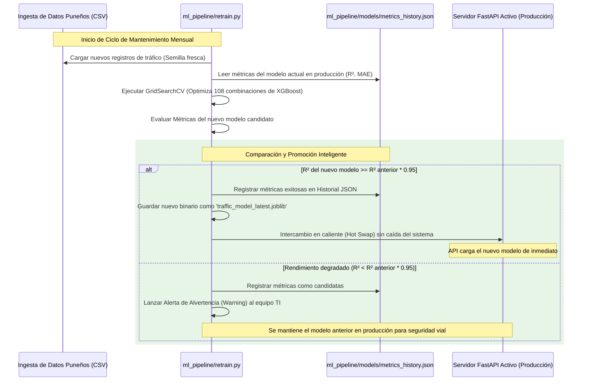

# 🚦 PunoTraffic AI — Informe Técnico y Arquitectura de MLOps Unificada (FastAPI)

Este documento técnico detalla la arquitectura, el diseño de ingeniería de software, los flujos de integración continua (CI/CD) y el pipeline de entrenamiento del proyecto **PunoTraffic AI**. Ha sido consolidado para servir como manual de referencia para el equipo de TI responsable del despliegue, mantenimiento e integración continua del sistema.

---

## 👥 Equipo de Proyecto
* **Equipo:** Grupo Arthes Nemethins (MAMANI MENDOZA JOSEPH ELVIS
, TAPARA CCAHUANA PAUL RENMIS
* **Curso:** Aprendizaje de Máquina (9no Semestre)
* **Institución:** Universidad Nacional del Altiplano - Puno
* **Fecha:** Viernes 29 de mayo de 2026

---

## 📂 1. Organización del Código Fuente (Clean Architecture Unificada)

El proyecto adopta la filosofía de **Separación de Responsabilidades** (SoC), estructurado de manera que el entrenamiento del modelo (Machine Learning) ocurra de forma autónoma, mientras que el backend y frontend residan bajo una **única aplicación web consolidada en FastAPI**, eliminando servidores redundantes y maximizando la velocidad de respuesta.

```text
pryecto2/
├── .github/                 # Integración Continua (CI/CD)
│   └── workflows/
│       └── ci_cd.yml        # Flujo de trabajo automatizado de GitHub Actions
├── backend/                 # Servidor Web y API Consolidados (FastAPI)
│   ├── app/
│   │   ├── api.py           # Enrutador y Endpoints (/predict, /health, /metrics-history)
│   │   ├── core/
│   │   │   └── config.py    # Configuración del entorno segura (Pydantic Settings)
│   │   ├── main.py          # Punto de entrada de FastAPI y ruteador estático (/)
│   │   ├── models.py        # Esquemas de Validación y Tipos de Datos (Pydantic v2)
│   │   ├── services/
│   │   │   └── prediction.py# Servicio Singleton de carga e inferencia del modelo
│   │   └── static/          # Frontend SPA (Single Page Application)
│   │       └── index.html   # Interfaz interactiva, OpenStreetMap y Aula de IA
│   ├── tests/               # Pruebas automatizadas (Pytest)
│   │   ├── conftest.py      # Fixtures compartidas y cliente de prueba
│   │   └── test_api.py      # 20 Casos de prueba de integración de la API
│   ├── Dockerfile           # Construcción multi-stage ligera para Backend
│   └── requirements-dev.txt # Dependencias de ejecución y testing separadas
├── ml_pipeline/             # Pipeline de Machine Learning
│   ├── data/
│   │   └── puno_traffic.csv # Dataset de entrenamiento vehicular puneño
│   ├── models/
│   │   ├── metrics_history.json # Historial JSON de telemetría de modelos (MLOps)
│   │   └── traffic_model_latest.joblib # Binario serializado del mejor modelo
│   ├── generate_data.py     # Generador de datos sintéticos con patrones Puneños
│   ├── train.py             # Entrenamiento optimizado con GridSearch (108 combos)
│   ├── retrain.py           # Pipeline automatizado de reentrenamiento y promoción
│   └── requirements.txt     # Dependencias específicas de ciencia de datos
├── docker-compose.yml       # Orquestador local del servicio único
├── run.bat                  # Script de inicio rápido con doble clic en Windows (Puerto 8000)
└── run.ps1                  # Script de inicio rápido en PowerShell (Puerto 8000)
```

### Justificación de la Arquitectura Consolidada:
1. **Unificación en FastAPI:** Al servir la interfaz de usuario `index.html` directamente desde FastAPI (método `serve_index` en la ruta `/`), se reduce la complejidad del sistema. Cero problemas de configuración de CORS entre orígenes cruzados y un solo puerto en escucha en el servidor de producción.
2. **Eficiencia en Memoria (Patrón Singleton):** La clase `PredictionService` carga el modelo XGBoost (`.joblib`) **una única vez** al iniciar la API. Las llamadas al simulador ocurren mediante peticiones asíncronas HTTP sumamente eficientes.
3. **SPA Asíncrono (Single Page Application):** El frontend corre directamente en el navegador del cliente. Al arrastrar los controles, el cliente realiza peticiones asíncronas fetch ultrarrápidas, pintando los gráficos y círculos de OpenStreetMap instantáneamente sin necesidad de recargar la página.

---

## 🛠 2. Herramientas, Plataformas y Tecnologías Requeridas

El ecosistema tecnológico combina alta velocidad de respuesta con facilidad de mantenimiento y automatización de procesos MLOps:

| Tecnología | Rol en el Proyecto | Versión Utilizada | Razón de Selección |
|---|---|---|---|
| **Python** | Lenguaje Base | `3.11` | Soporte de tipado estático, estabilidad y compatibilidad de ciencia de datos. |
| **FastAPI** | Servidor Web y API | `0.110.x` | Desempeño asíncrono excepcional. Sirve de forma nativa JSON, endpoints y el archivo HTML estático. |
| **XGBoost** | Algoritmo de ML | `2.0.x` | Algoritmo basado en Gradient Boosting de árboles de decisión. Es el líder indiscutible en precisión para datos tabulares. |
| **Leaflet.js** | Visualizador de Mapas | `1.9.4` (CDN) | Librería líder de mapas interactivos. Conecta con los azulejos (tiles) libres de **OpenStreetMap** para renderizar Puno en 3D/2D sin requerir tokens pagos de Mapbox o Google Maps. |
| **Chart.js** | Gráficos vectoriales | `4.x` (CDN) | Gráficos responsivos y sumamente fluidos que actualizan de forma asíncrona mediante APIs de Javascript. |
| **TailwindCSS** | Diseño de UI/UX | `3.x` (CDN) | Framework de estilos utilitarios que nos permite implementar un diseño oscuro, responsivo y dinámico con estética premium. |
| **Pytest** | Batería de Pruebas | `8.0.x` | Suite de pruebas de regresión e inyección de fixtures. |
| **Docker** | Contenedorización | `25.x` | Aislar el software de las variaciones del sistema operativo anfitrión. |
| **GitHub Actions** | Automatización CI/CD | - | Integración continua nativa en la nube. |

---

## 🚀 3. Consideraciones de Despliegue Inicial de la Aplicación

El despliegue ha sido simplificado al máximo gracias a la unificación de servicios.

### Pre-requisitos del Sistema:
* Python 3.11+ instalado (para desarrollo local).
* Docker Desktop y Docker Compose instalados (para producción).

### Paso 1: Generación e Ingesta del Modelo Inicial
El backend requiere la existencia del modelo entrenado en la carpeta de intercambio `ml_pipeline/models/`. Para generarlo por primera vez:
```bash
# Navegar e instalar dependencias del pipeline
cd ml_pipeline
pip install -r requirements.txt

# Ejecutar el entrenamiento con GridSearch optimizado
python train.py
cd ..
```
*Este proceso generará el archivo `traffic_model_latest.joblib` y creará la base del archivo `metrics_history.json`.*

### Paso 2: Despliegue Automatizado con Docker
Una vez creado el binario del modelo, podemos lanzar toda la plataforma utilizando Docker Compose:
```bash
docker-compose up --build -d
```
*Este comando compilará el contenedor único de FastAPI en puerto 8000 y lo dejará operando en segundo plano de manera segura.*

### Paso 3: Puertos del Servidor y Acceso
* **Interfaz Web y Aplicación Principal (SPA):** Acceso en [http://localhost:8000/](http://localhost:8000/)
* **Documentación Interactiva de la API (Swagger):** Acceso en [http://localhost:8000/docs](http://localhost:8000/docs)

---

## 🔒 4. Hardening y Seguridad en Producción (Docker Multi-stage)

Para garantizar que el software sea apto para un entorno empresarial, se aplican técnicas de hardening en el contenedor:
1. **Multi-Stage Builds:** El archivo `Dockerfile` divide la compilación del contenedor en fases de desarrollo y ejecución. En el contenedor final **solo se copian los ejecutables y dependencias compiladas**, reduciendo el peso de la imagen de 1GB a menos de 200MB, eliminando vulnerabilidades de compiladores en producción.
2. **Usuario no Root:** Por defecto, los contenedores corren como superusuario (`root`). Hemos configurado un usuario sin privilegios en el sistema operativo (`appuser` con UID 10001) para ejecutar los procesos, evitando que vulnerabilidades de ejecución remota puedan comprometer el servidor anfitrión.
3. **Healthchecks de Red:** Configurados directamente en los contenedores de Docker para monitorear constantemente la salud del backend mediante solicitudes HTTP internas a `/health`.

---

## 🔄 5. Flujos de Integración Continua (CI/CD)

El archivo `.github/workflows/ci_cd.yml` orquesta la verificación y empaquetamiento seguro del software cada vez que un miembro del equipo realiza un cambio (`push` o `pull request` en la rama `main`).

```mermaid
graph TD
    A[Programador Push / Pull Request] --> B[Disparador GitHub Actions]
    subgraph Fase 1: Calidad de Código (Linting)
        B --> C[Instalar Python 3.11]
        C --> D[Correr Flake8 en Backend/ML]
    end
    subgraph Fase 2: Pruebas y Validación (Testing)
        D --> E[Instalar Dependencias de Desarrollo]
        E --> F[Entrenar Modelo de Prueba]
        F --> G[Correr 20 Tests Unitarios de Integridad con Pytest]
    end
    subgraph Fase 3: Compilación y Despliegue (Build)
        G --> H{¿Es la rama main?}
        H -- Sí --> I[Construir Imagen Docker de Contenedor FastAPI Único]
        I --> J[Listo para Promoción a Registro]
        H -- No --> K[Fin del Pipeline sin Compilación]
    end
```

### Detalle de las Etapas:
1. **Linting (Flake8):** Garantiza que todo el código del equipo siga el estándar internacional PEP 8 (longitud de líneas de 120 caracteres, sin variables huérfanas o importaciones redundantes). Si hay errores de estilo, el pipeline falla de inmediato.
2. **Model Training Check:** El pipeline entrena el modelo de XGBoost de manera automatizada en el entorno virtual de GitHub Actions para asegurar que los scripts de ciencia de datos no tengan errores de sintaxis y que las métricas resultantes sean coherentes.
3. **Integration Testing (Pytest):** Ejecuta la batería de **20 pruebas de integración** del backend de manera aislada, validando:
   * Códigos de respuesta HTTP (200 OK, 422 Unprocessable Entity para datos incorrectos).
   * Límites de los parámetros (horas fuera del rango 0-23, días de semana fuera de 0-6).
   * Manejo de tipos de datos incorrectos (ej. pasar cadenas de texto en campos numéricos).
4. **Dockerization (Compilación Final):** Si los tests y el formateo pasan con éxito en la rama `main`, GitHub Actions compila el contenedor de producción, garantizando que el paquete de software esté listo para su entrega a producción.

---

## 🔄 6. Pipeline de Mantenimiento Continuo (Ciclo de Reentrenamiento)

Los modelos de Machine Learning sufren de **Degradación de Modelo** (Model Drift) a medida que los patrones de tráfico reales en Puno cambian con los meses (ej. nuevas avenidas, cambios de sentido vial). El proyecto incluye un flujo de mantenimiento automatizado y continuo en `ml_pipeline/retrain.py` que se ejecuta mediante tareas programadas (cron) o llamadas a APIs:



### Reglas de Negocio en el Mantenimiento:
* **Grid Search de 108 Combinaciones:** El pipeline optimiza hiperparámetros clave de XGBoost como `n_estimators`, `max_depth`, `learning_rate` y `subsample` para garantizar que el nuevo modelo sea el mejor posible para los nuevos datos Puneños.
* **Validación de Promoción Automática:** Para evitar caídas o degradación de la inteligencia en producción, el script de mantenimiento compara el $R^2$ candidato contra el vigente. Si el nuevo rendimiento decae en más del 5% (indicio de datos ruidosos o sobreajuste), **se emite una alerta preventiva y el modelo no se promueve a producción**, manteniendo a salvo la aplicación activa.
* **Persistencia en JSON:** Toda la historia de los modelos entrenados (métricas, parámetros ganadores, fecha de entrenamiento, cantidad de datos y semilla) queda persistida en `metrics_history.json` para facilitar las auditorías y auditorías de MLOps, siendo mostrada de manera transparente en la interfaz web principal del usuario.
